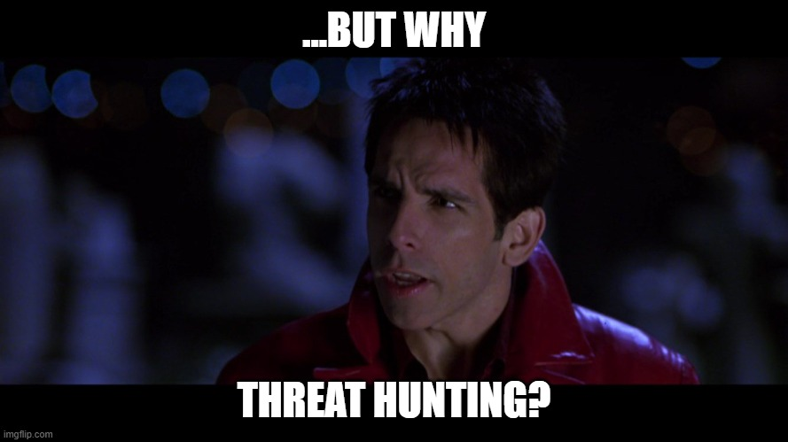

+++
author = "Tommy Fugger"
title = "Threat Hunting 101"
date = "2025-12-16"
description = "An Overview of Threat Hunting"
categories = ["Threat Hunting"]
tags = ["threat hunting"]
image = "ThreatHunting101.png"
+++

## Overview

What better way to kick this blog off than by providing an overview on threat hunting. It's been done a thousand times before, but threat hunting is a crucial, and often misunderstood, component of security. The purpose of this introductory post is to simply define some key aspects of threat hunting and provide a general process for the threat hunting workflow.

In the modern cybersecurity landscape, traditional defensive solutions such as firewalls, IDS/IPS, and EDR are essential but insufficient. Sophisticated adversaries are constantly developing new methods for bypassing such automated defenses. Thus enters threat hunting, a hypothesis-driven and proactive strategy for identifying sophisticated threats. Threat hunting has become a core capability for mature security teams, bridging the gap between traditional detection and proactive defense. Unlike alert-driven monitoring, threat hunting assumes that adversaries may already be present in an environment and focuses on identifying malicious activity that has evaded existing controls.

## What is Threat Hunting?

At its core, threat hunting is a hypothesis-driven, proactive security activity aimed at identifying threats that bypass automated detections.

Threat hunting differs from:
- SOC alert triage (reactive)
- Incident response (post-compromise)
- Threat intelligence consumption (contextual)

Instead, threat hunting:
- Starts with an assumption of compromise/hypothesis
- Leverages telemetry across endpoints, identity, cloud, and network
- Focuses on behaviors, not just alerts - we'll discuss indicators of attack vs indicators of compromise further down

Threat hunting does not replace automated detection and response - it compliments it.

## Why Threat Hunting?

As I've mentioned above, traditional security solutions simply are not sufficient on their own to disrupt sophisticated adversary activity. While firewalls, antivirus, and EDR systems are essential, they are primarily reactive — they wait for a known "signature" or alert to trigger. Sophisticated attackers know how to evade these triggers. By leveraging threat hunting capabilities, an organization can proactively find hidden attackers and advanced threats that bypass automated defenses, thus reducing dwell time, identifying security gaps, and disrupting adversary activity. Threat hunting is driven by an assumption of breach, which means operating under the premise that an adversary already has a foothold within a network.

## Core Concepts and Terminology

### Reactive vs. Proactive

We'll start with terms I've already mentioned several times: reactive vs. proactive.

Incident response, in general, is *reactive*:
- Action is triggered by an alert/incident
- Relies on known signatures, rules, or other predefined detection logic
- Effective for known/commodity threats; limited for novel or low-and slow
- This would be akin to receiving a home security alert about an intruder in your home and then investigating.

Threat hunting, on the other hand, is *proactive*:
- Action is initiated by an analyst's hypotheses
- Seeks unknown/evasive threats - finding a needle in a needle stack
- Focuses on attacker behavior and tradecraft rather than signatures
- Ultimately improves detection logic/telemetry/security posture over time
- This would be akin to *suspecting* an intruder is in your home without receiving a security alert and going to check.

### The Pyramid of Pain

This model was created by David Bianco and provides a great visualization of the increasing difficulty adversaries face when you deny them certain indicators.
>   
[The Pyramid of Pain - David Bianco](https://detect-respond.blogspot.com/2013/03/the-pyramid-of-pain.html)

The pyramid works its way up from lowest to highest impact. At the bottom half of the pyramid we have hash values, IP addresses, and domain names, all of which are rather inconsequential for an attacker to change. Threat hunting aims to operate at the top of the pyramid, focusing on adversary TTPs and actually disrupting how they operate. This causes the most "pain" for adversaries by forcing them to change their behaviors.

### IOCs vs IOAs

This is a crucial concept to understand. I've seen many junior hunters, or analysts seeking to transition from IR to hunting, struggle with this.

**Indicators of compromise (IOCs)** are artifacts that suggest a breach has already happened and typically spur an incident response. These indicators are easy for adversaries to change and are typically only discovered post-compromise.

Examples include:
- Malicious IPs or domains
- Malicious file hashes
- Known bad registry keys 

**Indicators of attack (IOAs)** focus on behavior associated with an active attack in progress or an emerging attack. Focusing on the behaviors associated with an attack make it harder for attackers to evade, and can even be effective in combating zero-days or custom tooling that would bypass signature detection.

Examples include:
- Credential dumping from LSASS
- Abnormal parent-child process relationships
- Execution of unsigned modules from memory

### MITRE ATT&CK Framework

*Every* threat hunter should be intimately familiar with the MITRE ATT&CK framework. This incredible knowledge base catalogs adversary behavior across tactics, techniques, and sub-techniques. Tactics provide the *why* of an action, such as initial access or persistence. Techniques and sub-techniques provide *how* a tactic is achieved, such as process injection or command and scripting interpreter. This framework is crucial for threat hunters because we frequently use it to structure a hypothesis. For instance, suppose we know an adversary of interest has a tendency to achieve credential access by targeting credentials stored in the process memory of the LSASS. T1003.001 - OS Credential Dumping: LSASS Memory would provide a starting point.

>   
ATT&CK Matrix for Enterprise – [MITRE ATT&CK Framework](https://attack.mitre.org/)

## Threat Hunting Methodologies

Now that we've discussed how the pyramid of pain, IOAs, and the MITRE ATT&CK framework fit into threat hunting, let's go over some different hunting methodologies. There are various approaches, and while no one way is "correct", mature threat hunting teams will blend all them all.

### Hypothesis-Driven Hunting

This is a creative and more mature approach to threat hunting. It begins with a question or a theory about a potential attack vector or adversary behavior. For example, you suspect/hypothesize that an attacker is abusing WMI to move laterally within your environment. You may then start to investigate for instances of WmiPrvSE.exe spawning cmd.exe or powershell.exe.

### Intelligence-Driven Hunting

This method is driven by external reporting, translating threat intelligence into behavioral queries. For example, if a recent report states that a specific APT is modifying registry key values to establish persistence, this could spur a hunt that searches for modification of the specific key.

### Data-Driven/Machine Learning-Driven Hunting

These hunts use data science to identify anomalies. It requires appropriate baselining to establish "normal" behavior, and then investigating statistical outliers - such as thin-tailed and fat-tailed distribution. For example, spikes in outbound traffic could be indicative of data exfiltration.

## Threat Hunt Lifecycle

Threat hunting is not random; it's actually a structured, repeatable lifecycle.

**1. Hypothesis Development**  
The hunt begins with some sort of trigger to generate a testable hypothesis; this could be a newly reported vulnerability, a new technique added to MITRE ATT&CK, or even a gut feeling based on recent trends. 

**2. Data Collection**  
After forming a hypothesis, we must determine that the necessary data actually exists to test the hypothesis. For instance, we must identify the relevant telemetry sources: do we ingest EDR logs? Do we have Windows Event Logs? Do we have PCAP or NetFlow data? The necessary data must exist in order to conduct a hunt.

**3. Analysis and Validation**  
Once we've identified the necessary data, we being to query and pivot. As we work through the data, we must validate our findings and filter out known good behavior to identify and isolate malicious activity. As a simple example, if we are running a search and observe that svchost.exe appears 1,000 times, but svch0st.exe appears once, we need to identify and investigate that anomaly.

**4. Escalation**  
Once we've validated malicious findings, we typically escalate the activity to the incident response team. The threat hunters role upon escalation is to provide context surrounding the activity, such as relevant artifacts, timelining, remediation recommendations, etc. 

**5. Detections and Feedback**  
At this point, threat hunters want to create and refine high-fidelity detection rules based on our hunt logic to identify and prevent reoccurring or future activity. This results in increased detection coverage and reduces gaps for your organization. We can also identify any shortcomings in our telemetry, such as improper sensor configurations or visibility gaps due to a lack of necessary logs.

**6. Documentation**  
A hunt should always be documented; documentation turns a hunt into a key security asset for your organization by translating hunt logic into automated detections and ensuring reproducibility for your team. It provides evidence of impact and proof of value to justify the need for threat hunting operations.

## What Does A Successful Hunt Look Like?

I cannot emphasize enough that the success of a hunt is *not* determined by whether or not an active threat was found. In fact, finding an active threat as a result of hunt efforts is quite rare. While that would be the "ideal" outcome, there are a number of other metrics that demonstrate the success of a hunt:

- Identifying detection gaps and/or vulnerablities
- Improving visibility and telemetry
- Creating high-fidelity detections
- Validating assumptions
- Reducing future dwell time  

A successful hunt that did not illuminate an active threat should prove that an adversary isn't present using the specific technique hunted on. What is key is that the hunt results in actionable improvements. With that said, let's take a quick look at some common pitfalls that result in an *unsuccessful* hunt:  

- Hunting without a hypothesis
- Focusing heavily on IOCs rather than IOAs
- Overscoping queries without behavioral context
- Failing to document outcomes
- Lack of operational improvements

## Final Thoughts

Threat hunting is the relentless pursuit of the unknown. It transitions security posture from a defensive mindset to an offensive one. By focusing on adversary behavior, leveraging frameworks like MITRE ATT&CK, and continuously refining detections, threat hunters can meaningfully disrupt sophisticated attackers and uncover threats that technology alone cannot catch.




